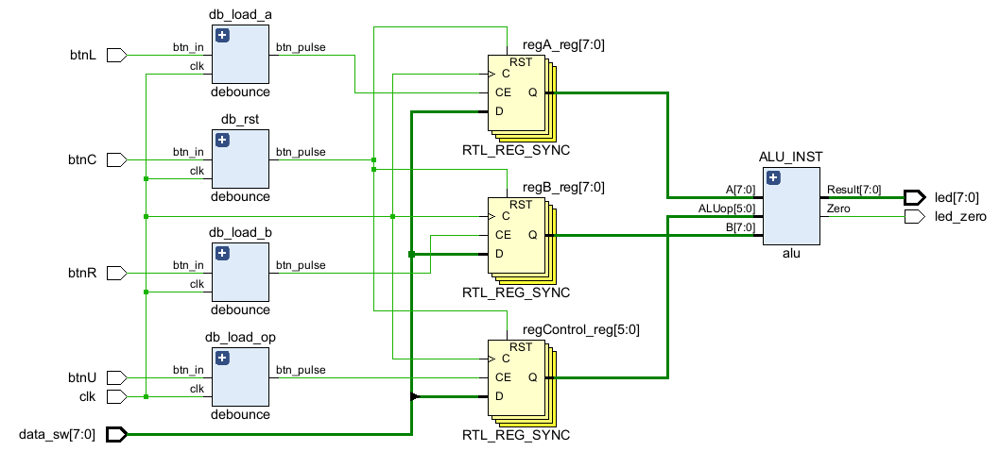
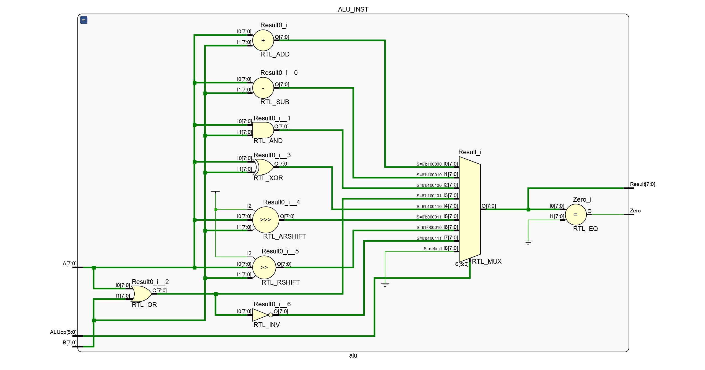
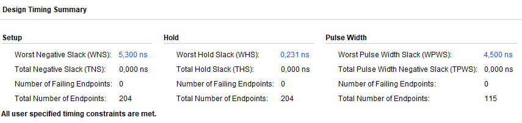

# Trabajo Práctico: Diseño e Implementación de una ALU en FPGA

## 1. Introducción
El presente informe detalla el proceso de diseño, descripción en hardware, síntesis e implementación de una ALU de 8 bits. El desarrollo se llevó a cabo utilizando el lenguaje Verilog y el entorno de desarrollo Xilinx Vivado. 

## 2. Arquitectura y Diseño de la ALU

### 2.1. Repertorio de Operaciones
La ALU diseñada opera con palabras de datos de 8 bits y es controlada por un código de operación (OpCode) de 6 bits. La arquitectura soporta operaciones aritméticas, lógicas y de desplazamiento, según se detalla en la siguiente tabla:

| Operación | Código (OpCode) | Descripción |
| :--- | :--- | :--- |
| **ADD** | `100000` | Suma aritmética |
| **SUB** | `100010` | Resta aritmética |
| **AND** | `100100` | AND lógico bit a bit |
| **OR**  | `100101` | OR lógico bit a bit |
| **XOR** | `100110` | XOR lógico bit a bit |
| **NOR** | `100111` | NOR lógico bit a bit |
| **SRA** | `000011` | Desplazamiento aritmético a la derecha (Shift Right Arithmetic) |
| **SRL** | `000010` | Desplazamiento lógico a la derecha (Shift Right Logical) |

### 2.2. Manejo de Tipos de Datos y Desplazamientos
Un aspecto crítico del diseño en Verilog fue la correcta implementación del desplazamiento aritmético a la derecha (SRA). A diferencia del desplazamiento lógico (SRL), que rellena los bits más significativos (MSB) con ceros, el SRA debe preservar el signo del operando original, replicando el MSB. 

Para lograr este comportamiento a nivel de hardware, los operandos de entrada se declararon con el modificador `signed` en Verilog. Esto instruye a la herramienta de síntesis a interpretar el vector de bits en complemento a dos y, en consecuencia, inferir el hardware necesario para realizar la extensión de signo al aplicar el operador de corrimiento aritmético (`>>>`).

## 3. Interfaz de Hardware y Módulo Top-Level

Para la interacción física con la FPGA, se diseñó un módulo Top-Level que instancia la ALU y gestiona la entrada/salida de datos mediante los periféricos de la placa.

*   **Entradas de Datos (8 Switches):** Se dispone de 8 interruptores físicos configurados como un bus de entrada único. Este bus se multiplexa en el tiempo para cargar los distintos elementos del sistema.
*   **Control y Enrutamiento (4 Botones):** Se definieron 3 registros de almacenamiento internos: *Registro A* (Operando 1), *Registro B* (Operando 2) y *Registro de Operación*. Mediante la pulsación de 3 botones distintos, el valor actual presente en los 8 switches se captura y se almacena en el registro correspondiente. Un cuarto botón está dedicado a la señal de reinicio global (*Reset*), llevando el sistema a un estado inicial seguro.
*   **Salidas (9 LEDs):** El resultado de la operación procesada por la ALU se visualiza de forma instantánea en 8 LEDs. Un noveno LED actúa como bandera de estado (*Zero Flag*), encendiéndose únicamente cuando el resultado de la operación en el bus de salida es cero.

## 4. Síntesis Lógica

A continuación, se presenta el esquema resultante de la etapa de síntesis lógica. En este diagrama se puede observar cómo Vivado interpretó el código Verilog, infiriendo los multiplexores para la selección de operaciones, los sumadores/restadores y los registros de almacenamiento implementados mediante Flip-Flops.

*En el diagrama se destaca la inferencia del bloque combinacional principal de la ALU, multiplexado según la señal de OpCode, y la lógica secuencial asociada a los registros de entrada controlados por los botones.*

## 5. Análisis Temporal (Timing Analysis)

Una vez completada la fase de implementación y ruteo (Implementation & Routing), se analizó el reporte de temporización post-implementación para garantizar que el diseño cumpla con las restricciones físicas de la FPGA sin violar los tiempos de *Setup* (establecimiento) y *Hold* (retención) de los biestables.

*   **Análisis de Setup:** El peor margen negativo (WNS - *Worst Negative Slack*) arroja un valor positivo de **5.300 ns**. Al ser positivo y presentar un TNS (*Total Negative Slack*) nulo (0.000 ns), se confirma que no existen violaciones en ninguno de los 204 *endpoints* evaluados. Esto significa que las señales tienen tiempo suficiente para propagarse a través de la lógica combinacional de la ALU y estabilizarse antes de la llegada del próximo flanco de reloj.
*   **Análisis de Hold:** El peor margen de retención (WHS - *Worst Hold Slack*) es de **0.231 ns**. Al igual que en el caso anterior, un valor positivo con un THS de 0.000 ns garantiza que los datos permanecen estables el tiempo mínimo requerido tras el flanco de reloj, evitando condiciones de carrera.

## 6. Conclusiones

La implementación en hardware validó el diseño de la lógica combinacional de la ALU. Se comprobó que declarar los operandos como signed en Verilog es indispensable para la correcta inferencia y síntesis del corrimiento aritmético (SRA). Además, la captura secuencial de datos en registros permitió multiplexar las entradas de los switches, lo que redujo significativamente la necesidad de pines I/O y optimizó la utilización de los recursos de la FPGA.