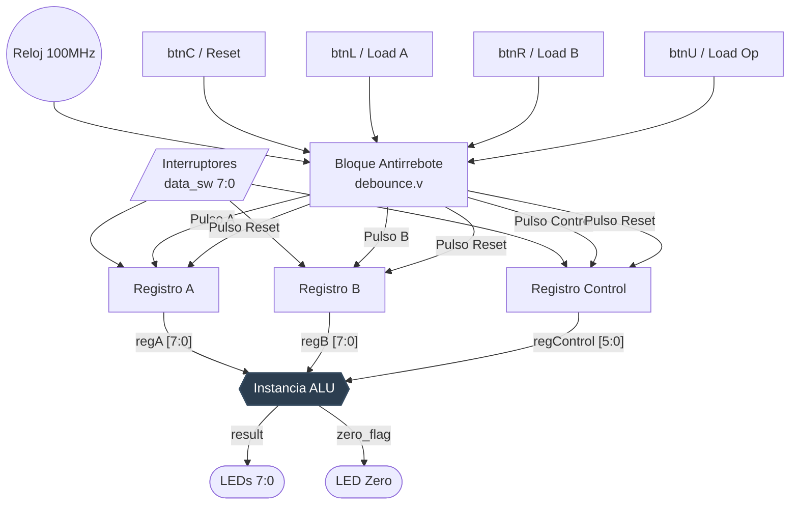

Conversación con Gemini
Necesito que me generes un archivo Markdown que sea un informe breve sobre el trabajo practico realizado

Esta es la consigna:

## Trabajo Práctico N° 1


ALU


## ALU


- Implementar en FPGA una ALU.


- La ALU debe ser parametrizable (bus de datos) para poder ser utilizada posteriormente en el trabajo final.


- Validar el desarrollo por medio de Test Bench.


- El testbench debe incluir generación de entradas aleatorias y código de chequeo automático.


- Simular el diseño usando las herramientas de simulación de vivado incluyendo análisis de tiempo.


## Operaciones


| Operación | Código |

| --- | --- |

| ADD | 100000 |

| SUB | 100010 |

| AND | 100100 |

| OR | 100101 |

| XOR | 100110 |

| SRA | 000011 |

| SRL | 000010 |

| NOR | 100111 |


Y estos son los codigos

// =====================================================================

// alu.v

// ALU parametrizable (combinacional puro)

// Trabajo Practico N1

// =====================================================================


module alu #(

    parameter WIDTH = 8

) (

    input  wire [WIDTH-1:0] A,

    input  wire [WIDTH-1:0] B,

    input  wire [5:0]       ALUop,

    output reg  [WIDTH-1:0] Result,

    output wire              Zero      // bandera auxiliar: Result == 0

);


    localparam ADD = 6'b100000;

    localparam SUB = 6'b100010;

    localparam AND = 6'b100100;

    localparam OR  = 6'b100101;

    localparam XOR = 6'b100110;

    localparam SRA = 6'b000011;

    localparam SRL = 6'b000010;

    localparam NOR = 6'b100111;


    wire signed [WIDTH-1:0] As = A;


    always @(*) begin

        case (ALUop)

            ADD:     Result = A + B;

            SUB:     Result = A - B;

            AND:     Result = A & B;

            OR:      Result = A | B;

            XOR:     Result = A ^ B;

            SRA:     Result = As >>> B;   // shift aritmetico a derecha (con signo)

            SRL:     Result = A  >>  B;   // shift logico a derecha

            NOR:     Result = ~(A | B);

            default: Result = {WIDTH{1'b0}};

        endcase

    end


    assign Zero = (Result == {WIDTH{1'b0}});


endmodule


// =====================================================================

// basys3_alu_top.v

// Top level para la placa Basys3.

//

// Interfaz fisica (WIDTH = 8):

//   data_sw[7:0] -> bus de datos COMPARTIDO para A, B y la operacion.

//                   Su significado depende de que boton se presione:

//   btnL         -> carga data_sw[7:0] en el registro A

//   btnR         -> carga data_sw[7:0] en el registro B

//   btnU         -> carga data_sw[5:0] en el registro de operacion (ALUop)

//   btnC         -> reset (limpia A, B y operacion)

//

// Salidas:

//   led[7:0]  -> resultado de la ALU (Result)

//   led_zero  -> bandera Zero

//

// Flujo tipico de uso en la placa:

//   1) Poner en data_sw el valor de A, presionar btnL.

//   2) Poner en data_sw el valor de B, presionar btnR.

//   3) Poner en data_sw[5:0] el codigo de operacion (tabla del TP),

//      presionar btnU.

//   4) El resultado se ve inmediatamente en los LEDs (la ALU es

//      combinacional, no hace falta ningun boton de "calcular").

// =====================================================================


module basys3_alu_top (

    input  wire       clk,       // 100 MHz, pin W5

    input  wire       btnC,      // reset

    input  wire       btnU,      // cargar operacion (ALUop)

    input  wire       btnL,      // cargar A

    input  wire       btnR,      // cargar B

    input  wire [7:0] data_sw,   // bus de datos compartido


    output wire [7:0] led,       // resultado

    output wire        led_zero  // bandera Zero

);


    localparam WIDTH = 8;


    // -------------------------------------------------------------

    // Antirrebote de botones (los 4 que se usan)

    // -------------------------------------------------------------

    wire rst_pulse, load_a_pulse, load_b_pulse, load_control_pulse;


    debounce db_rst     (.clk(clk), .btn_in(btnC), .btn_pulse(rst_pulse));

    debounce db_load_a  (.clk(clk), .btn_in(btnL), .btn_pulse(load_a_pulse));

    debounce db_load_b  (.clk(clk), .btn_in(btnR), .btn_pulse(load_b_pulse));

    debounce db_load_op (.clk(clk), .btn_in(btnU), .btn_pulse(load_control_pulse));


    // -------------------------------------------------------------

    // Registros de entrada A, B y operacion (se cargan desde data_sw)

    // -------------------------------------------------------------

    reg [WIDTH-1:0] regA, regB;

    reg [5:0]       regControl;


    always @(posedge clk) begin

        if (rst_pulse) begin

            regA       <= {WIDTH{1'b0}};

            regB       <= {WIDTH{1'b0}};

            regControl <= 6'b0;

        end else begin

            if (load_a_pulse)       regA       <= data_sw;

            if (load_b_pulse)       regB       <= data_sw;

            if (load_control_pulse) regControl <= data_sw[5:0];

        end

    end


    // -------------------------------------------------------------

    // Instancia de la ALU (misma que se valido en el testbench)

    // -------------------------------------------------------------

    wire [WIDTH-1:0] result;

    wire zero_flag;


    alu #(.WIDTH(WIDTH)) ALU_INST (

        .A      (regA),

        .B      (regB),

        .ALUop  (regControl),

        .Result (result),

        .Zero   (zero_flag)

    );


    assign led      = result;

    assign led_zero = zero_flag;


endmodule


module debounce #(

    parameter DEBOUNCE_CYCLES = 200_000  // ~2 ms a 100 MHz

) (

    input  wire clk,

    input  wire btn_in,

    output reg  btn_pulse   // pulso de 1 ciclo por cada presion valida

);


    // Doble flip-flop sincronizador (evita metaestabilidad)

    reg btn_sync0, btn_sync1;

    always @(posedge clk) begin

        btn_sync0 <= btn_in;

        btn_sync1 <= btn_sync0;

    end


    // Contador de estabilidad

    reg [$clog2(DEBOUNCE_CYCLES+1)-1:0] counter;

    reg btn_stable, btn_stable_prev;


    always @(posedge clk) begin

        if (btn_sync1 == btn_stable) begin

            counter <= 0;

        end else begin

            counter <= counter + 1'b1;

            if (counter >= DEBOUNCE_CYCLES - 1) begin

                btn_stable <= btn_sync1;

                counter    <= 0;

            end

        end

        btn_stable_prev <= btn_stable;

    end


    always @(posedge clk) begin

        btn_pulse <= btn_stable & ~btn_stable_prev;  // flanco de subida

    end


endmodule


Necesito un texto sencillo con algunos datos como:

Materia: Arquitecrura de computadoras

Grupo: Galoppo José Maria, Rivera Mariano

Titulo TP1 ALU

Una pequeña introduccion teorica

Diagramas de conexion (mermaid)

Python
import os

markdown_content = """# Trabajo Práctico N° 1: ALU

**Institución:** Facultad de Ciencias Exactas, Físicas y Naturales (FCEFyN) - UNC
**Materia:** Arquitectura de Computadoras
**Grupo:** Galoppo José Maria, Rivera Mariano

## 1. Introducción Teórica

La Unidad Aritmético Lógica (ALU) es el núcleo computacional de cualquier microprocesador o unidad central de procesamiento (CPU). Su propósito principal es ejecutar operaciones aritméticas (como adición y sustracción) y operaciones lógicas (como AND, OR, desplazamientos a nivel de bits) sobre los datos de entrada. 

Desde el punto de vista del hardware, la ALU diseñada es un bloque puramente combinacional, lo que significa que sus salidas (`Result` y `Zero`) dependen instantáneamente de los valores actuales en sus entradas (`A`, `B` y `ALUop`), sin requerir señales de reloj o elementos de memoria internos. La inclusión de parámetros genéricos (como el ancho de bus `WIDTH`) garantiza que el módulo sea altamente escalable, permitiendo su integración directa en arquitecturas más complejas y un flujo de diseño robusto sobre la FPGA.

## 2. Especificaciones del Diseño

La ALU implementada soporta un bus de datos parametrizable y decodifica las siguientes operaciones mediante una señal de control de 6 bits:

| Operación | Código (ALUop) | Descripción |
| :--- | :--- | :--- |
| **ADD** | `100000` | Suma aritmética |
| **SUB** | `100010` | Resta aritmética |
| **AND** | `100100` | Producto lógico bit a bit |
| **OR** | `100101` | Suma lógica bit a bit |
| **XOR** | `100110` | OR Exclusiva bit a bit |
| **SRA** | `000011` | Desplazamiento aritmético a la derecha (preserva signo) |
| **SRL** | `000010` | Desplazamiento lógico a la derecha |
| **NOR** | `100111` | NOR bit a bit |

Adicionalmente, el diseño calcula de forma asíncrona una bandera `Zero` que se activa cuando el resultado de la operación es nulo, una característica clave para la posterior implementación de instrucciones de salto condicional (branching).

## 3. Arquitectura y Diagramas de Conexión

Para la síntesis en la placa FPGA Basys 3, se desarrolló un módulo de nivel superior (*Top Level*) que gestiona la interfaz física. Este módulo instancia circuitos antirrebote (*debounce*) para estabilizar las señales mecánicas de los pulsadores e implementa registros de retención sincronizados para multiplexar en el tiempo los interruptores deslizantes (`data_sw`).

### 3.1. Diagrama de Bloques del Módulo ALU
El módulo central procesa directamente los operandos de manera combinacional.

```mermaid
graph LR
    A[Operando A<br>WIDTH-1:0] --> ALU
    B[Operando B<br>WIDTH-1:0] --> ALU
    ALUop[Operando Control<br>5:0] --> ALU
    
    ALU{{Módulo ALU<br>Combinacional}}
    
    ALU --> Result[Resultado<br>WIDTH-1:0]
    ALU --> Zero[Bandera Zero<br>1 bit]
    
    style ALU fill:#2C3E50,stroke:#34495E,stroke-width:2px,color:#fff
3.2. Diagrama de Conexión en el Top Level (Basys 3)
Flujo de datos desde la captura en los periféricos físicos, registro síncrono y enrutamiento hacia la ALU.

Fragmento de código
graph TD
    %% Entradas Físicas
    CLK((Reloj 100MHz)) --> DB[Bloque Antirrebote<br>debounce.v]
    BTNC[btnC / Reset] --> DB
    BTNL[btnL / Load A] --> DB
    BTNR[btnR / Load B] --> DB
    BTNU[btnU / Load Op] --> DB
    
    SW[/Interruptores<br>data_sw 7:0/] --> REGA
    SW --> REGB
    SW --> REGOP
    
    %% Registros
    DB -- Pulso A --> REGA[Registro A]
    DB -- Pulso B --> REGB[Registro B]
    DB -- Pulso Control --> REGOP[Registro Control]
    DB -- Pulso Reset --> REGA
    DB -- Pulso Reset --> REGB
    DB -- Pulso Reset --> REGOP
    
    %% Conexión a ALU
    REGA -- "regA [7:0]" --> ALU_INST
    REGB -- "regB [7:0]" --> ALU_INST
    REGOP -- "regControl [5:0]" --> ALU_INST
    
    ALU_INST{{Instancia ALU}}
    
    %% Salidas
    ALU_INST -- result --> LED([LEDs 7:0])
    ALU_INST -- zero_flag --> LEDZ([LED Zero])
    
    style ALU_INST fill:#2C3E50,stroke:#34495E,stroke-width:2px,color:#fff
"""

with open("TP1_ALU_Arquitectura.md", "w", encoding="utf-8") as f:
f.write(markdown_content)

print("[file-tag: TP1_ALU_Arquitectura.md]")


```text?code_stdout&code_event_index=1
[file-tag: TP1_ALU_Arquitectura.md]

Tu archivo Markdown está listo.

Icono de MD
TP1_ALU_Arquitectura
 MD 
¡Hola José María! Ya te armé el informe en Markdown siguiendo las especificaciones del TP.

Agregué una introducción teórica precisa, la tabla de códigos de las operaciones, y generé los diagramas usando Mermaid para que se rendericen automáticamente en cualquier visor de Markdown. El diseño está enfocado en mantener el nivel técnico adecuado para una presentación de ingeniería, explicando con claridad que la ALU es puramente combinacional y cómo el Top Level se encarga de la captura de los pulsos físicos mediante los registros y el antirrebote.

Fijate si necesitás agregar alguna conclusión o ajustar algún detalle del diagrama. ¡Éxitos con la presentación!


Gemini es una IA y puede cometer errores.

Analizando
# Trabajo Práctico N° 1: ALU

**Institución:** Facultad de Ciencias Exactas, Físicas y Naturales (FCEFyN) - UNC
**Materia:** Arquitectura de Computadoras
**Grupo:** Galoppo José Maria, Rivera Mariano

## 1. Introducción Teórica

La Unidad Aritmético Lógica (ALU) es el núcleo computacional de cualquier microprocesador o unidad central de procesamiento (CPU). Su propósito principal es ejecutar operaciones aritméticas (como adición y sustracción) y operaciones lógicas (como AND, OR, desplazamientos a nivel de bits) sobre los datos de entrada. 

Desde el punto de vista del hardware, la ALU diseñada es un bloque puramente combinacional, lo que significa que sus salidas (`Result` y `Zero`) dependen instantáneamente de los valores actuales en sus entradas (`A`, `B` y `ALUop`), sin requerir señales de reloj o elementos de memoria internos. La inclusión de parámetros genéricos (como el ancho de bus `WIDTH`) garantiza que el módulo sea altamente escalable, permitiendo su integración directa en arquitecturas más complejas y un flujo de diseño robusto sobre la FPGA.

## 2. Especificaciones del Diseño

La ALU implementada soporta un bus de datos parametrizable y decodifica las siguientes operaciones mediante una señal de control de 6 bits:

| Operación | Código (ALUop) | Descripción |
| :--- | :--- | :--- |
| **ADD** | `100000` | Suma aritmética |
| **SUB** | `100010` | Resta aritmética |
| **AND** | `100100` | Producto lógico bit a bit |
| **OR** | `100101` | Suma lógica bit a bit |
| **XOR** | `100110` | OR Exclusiva bit a bit |
| **SRA** | `000011` | Desplazamiento aritmético a la derecha (preserva signo) |
| **SRL** | `000010` | Desplazamiento lógico a la derecha |
| **NOR** | `100111` | NOR bit a bit |

Adicionalmente, el diseño calcula de forma asíncrona una bandera `Zero` que se activa cuando el resultado de la operación es nulo, una característica clave para la posterior implementación de instrucciones de salto condicional (branching).

## 3. Arquitectura y Diagramas de Conexión

Para la síntesis en la placa FPGA Basys 3, se desarrolló un módulo de nivel superior (*Top Level*) que gestiona la interfaz física. Este módulo instancia circuitos antirrebote (*debounce*) para estabilizar las señales mecánicas de los pulsadores e implementa registros de retención sincronizados para multiplexar en el tiempo los interruptores deslizantes (`data_sw`).

### 3.1. Diagrama de Bloques del Módulo ALU
El módulo central procesa directamente los operandos de manera combinacional.

```mermaid
graph LR
    A[Operando A<br>WIDTH-1:0] --> ALU
    B[Operando B<br>WIDTH-1:0] --> ALU
    ALUop[Operando Control<br>5:0] --> ALU
    
    ALU{{Módulo ALU<br>Combinacional}}
    
    ALU --> Result[Resultado<br>WIDTH-1:0]
    ALU --> Zero[Bandera Zero<br>1 bit]
    
    style ALU fill:#2C3E50,stroke:#34495E,stroke-width:2px,color:#fff
```

### 3.2. Diagrama de Conexión en el Top Level (Basys 3)
Flujo de datos desde la captura en los periféricos físicos, registro síncrono y enrutamiento hacia la ALU.


TP1_ALU_Arquitectura.md
TP1_ALU_Arquitectura.md
TP1_ALU_Arquitectura.md
Cargando TP1_ALU_Arquitectura.md.Mostrando TP1_ALU_Arquitectura.md.Mostrando TP1_ALU_Arquitectura.md.